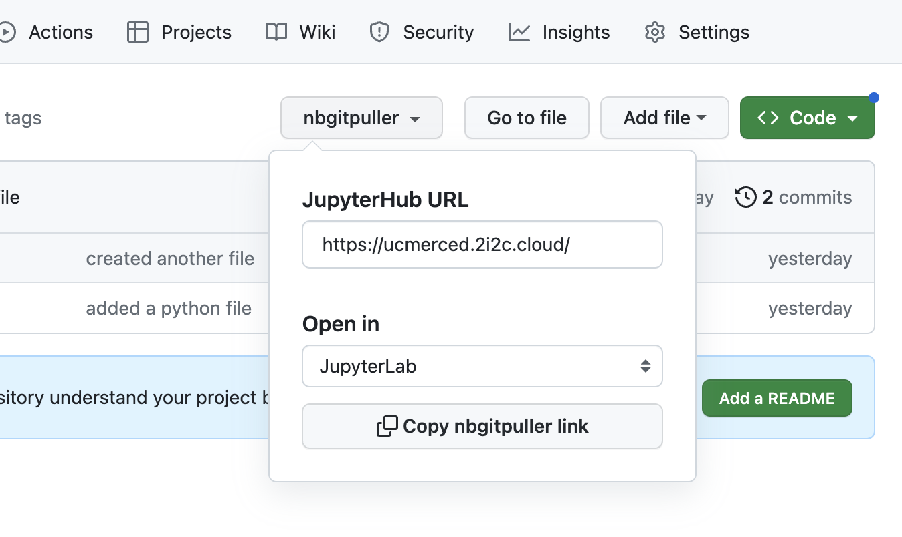
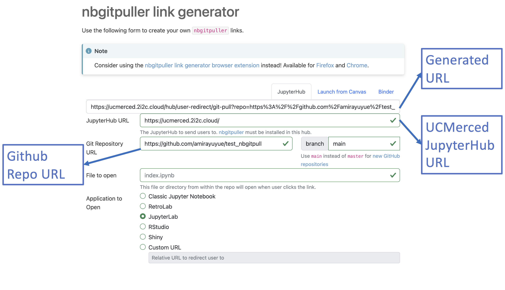

## Our UC Merced pilot JupyterHub infrastructure is online now ! <!-- {docsify-ignore} -->
> Please go to the website at  https://ucmerced.2i2c.cloud. 

All active UC Merced students, staff and faculty should have access to the pilot hub.

> What is JupyterHub?

JupyterHub is an open source tool that lets you host a distributed Jupyter Notebook environment. With JupyterHub, users can log in to the server, and write Python code in a web browser, without having to install software on their local machine.

We invite the UC Merced community to use the Hub for teaching (both now and future course planning) and exploring for research.

!> This pilot hub will be online for 11 months and feedback and usage information will be used to plan for our permanent JupyterHub.

> Instructions for Accessing the Pilot JupyterHub:
1. You can login through [UC Merced SSO](https://www.cilogon.org/home)
2. You can use the default jupyterhub image or you can change the image using the [configurator](https://github.com/2i2c-org/2i2c-hubs-image). You can also create your custom user image. There is a guide about this [here](https://docs.2i2c.org/en/latest/admin/howto/environment/index.html).
3. General information about the user environment [here](https://docs.2i2c.org/en/latest/admin/howto/environment/index.html).

If you have any additional questions accessing hub, please open a general OIT research computing ticket [here](https://ucmerced.service-now.com/servicehub?id=public_kb_article&sys_id=3c3ee9ff1b67a0543a003112cd4bcb13&form_id=06da3f8edbfc08103c4d56f3ce9619f4).

If you were not able to attend the workshop of JupyterHub, here is the recording [link](https://video.ucmerced.edu/media/JupyterHub+Workshop/1_ehe8hmux).

## Generate `nbgitpuller` link <!-- {docsify-ignore} -->
> Ensure that the `nbgitpuller` is installed into your environment

The default environment for 2i2c JupyterHubs has `nbgitpuller` pre-installed. However, if you define a [custom environment](https://docs.2i2c.org/admin/howto/environment/#environment-image) for your hub’s users, you’ll need to ensure that nbgitpuller is installed in order for users to use it!

To install the `nbgitpull`, please follow the instruction [here](https://github.com/jupyterhub/nbgitpuller)

> If you are using the Chrome or Firefox web browser you can directly download the browser extension to generate nbgitpuller [here](https://github.com/yuvipanda/nbgitpuller-link-generator-webextension)

Once the browser extenstion is installed, your github should directly have the `nbgitpuller` button.

> Put your content in a public GitHub repository

Create a repository on [GitHub](https://github.com/) and start putting your content there. This is the source of the content that will be distributed to your users. You can update it as often as you wish. While instructors will need to know how github works, your users will never have to interact with git directly.

> Generate an nbgitpuller link

Generate an [nbgitpuller link](https://nbgitpuller.readthedocs.io/en/latest/link.html). This uses a web-based generator (see the attached figure below) to generates a clickable link that contains within it the following pieces of information (alternatively, you can use the github `nbgitpuller` button to generate the link, see the figure above):

* The URL to the hub. Upon clicking the link, users will be redirected to this hub, and content will be pulled into their home directory there. 
* The URL of the git repository where the content lives.
* The branch in the git repository where the content lives. The default specified there is `master`, although newer GitHub repositories use `main` as the default. You can find yours on the Github page of your content repository
* The default interface to open when users click this link. The default is the classic notebook, but many other apps are available
* A file to open when the link is clicked. When left empty, a directory listing with the content of the repository will be shown

!> Unfortunately, `RStudio` does not support opening a specific file, and will always show the home directory. Users will have to manually navigate to the appropriate file.

