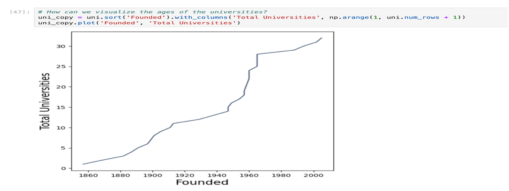
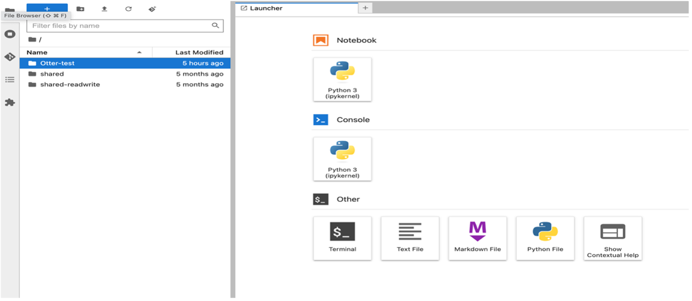
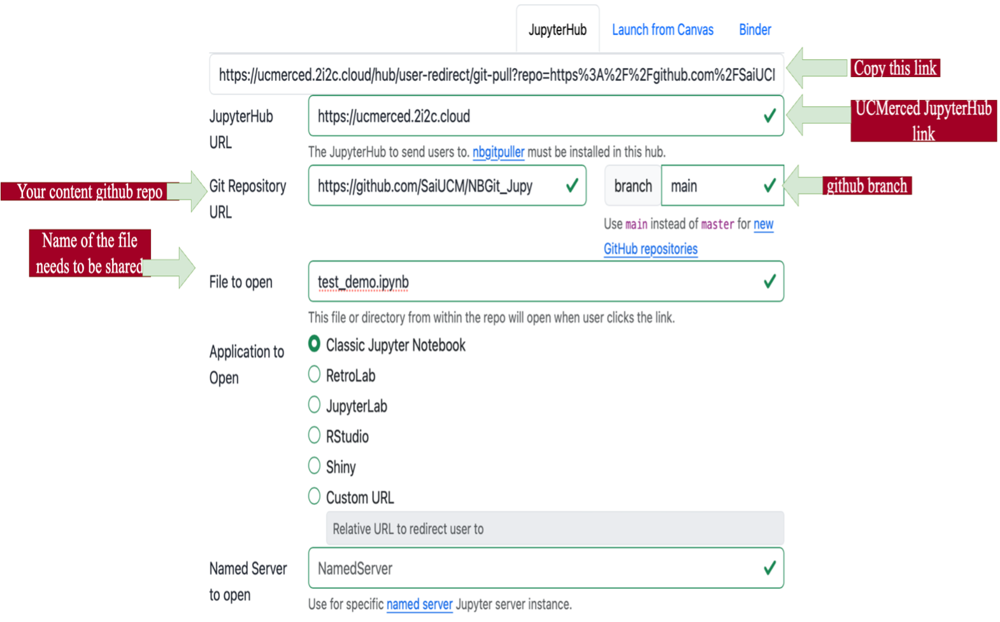

## Table of Contents
- [1. What are Jupyter Notebooks?](#1-what-are-jupyter-notebooks)
  - [1.1 Features](#11-features)
  - [1.2 Components](#12-components)
- [2. What is JupyterHub?](#2-what-is-jupyterhub)
- [3. How to access JupyterHub?](#3-how-to-access-jupyterhub)
  - [3.1 Login](#31-login)
  - [3.2 Choose Server](#32-choose-server)
  - [3.3 Start Server](#33-start-server)
- [4. Create New Notebook](#4-create-new-notebook)
- [5. Rename the Notebook](#5-rename-the-notebook)
- [6. How to run a notebook?](#6-how-to-run-a-notebook)
- [7. How to add code block?](#7-how-to-add-code-block)
- [8. How to add Markdown text cells in the notebook?](#8-how-to-add-markdown-text-cells-in-the-notebook)
- [9. How to download the notebook?](#9-how-to-download-the-notebook)
- [10. How to create a new folder?](#10-how-to-create-a-new-folder)
- [11. Installing packages on the Hub](#11-installing-packages-on-the-hub)
  - [11.1 Is it possible to install custom packages?](#111-is-it-possible-to-install-custom-packages)
  - [11.2 What packages & libraries are available?](#112-what-packages--libraries-are-available)
- [12. nbgitpuller](#12-nbgitpuller)
  - [12.1 Put your files in a public Github Repository](#121-put-your-files-in-a-public-github-repository)
  - [12.2 Generate nbgitpuller Link](#122-generate-nbgitpuller-link)
  - [12.3 Distribute your nbgitpuller link](#123-distribute-your-nbgitpuller-link)

## 1. What are Jupyter Notebooks?

Jupyter Notebook is an open-source web application that allows you to create and share documents that contain **live code**, equations, visualizations, and narrative text. Uses include data cleaning and transformation, numerical simulation, statistical modeling, data visualization, machine learning, and much more.

### 1.1 Features

- **Interactive Environment:** Jupyter Notebooks provide an interactive computing environment where users can write and execute code in a step-by-step manner.
- **Support for Multiple Languages:** While originally designed for Python, Jupyter Notebooks support various programming languages like Julia, Python, and R.
- **Rich Output:** Notebooks allow the incorporation of rich media outputs such as plots, images, videos, and interactive widgets alongside code and text cells.
- **Markdown Support:** In addition to code cells, users can include Markdown cells to write formatted text, equations (using LaTeX syntax), and even HTML for documentation or explanations.
- **Data Visualization:** Using libraries like Matplotlib, Seaborn, users can create interactive and static visualizations directly within the notebook environment.
- **Integration with Libraries and Tools:** Jupyter Notebooks seamlessly integrate with various data science libraries and tools such as NumPy, Pandas, SciPy, TensorFlow, and scikit-learn.

### 1.2 Components

- **Cells:** Notebooks are composed of individual cells that can contain either code, Markdown-formatted text, or raw content. Users can execute code cells and render Markdown cells to produce outputs.
  

- **Kernel:** Each notebook is associated with a computational kernel, which is responsible for executing code within the notebook. Different kernels support different programming languages.
  

- **Toolbar:** The toolbar provides quick access to common actions such as running cells, saving the notebook, adding new cells, and changing cell types.
  
- **Menu Bar:** The menu bar contains various options for manipulating the notebook, managing kernels, and configuring the notebook environment.
  
- **Output Area:** Code cells display their output, including text output, error messages, and visualizations, in the output area directly below the cell.
  
- **File Format:** Notebooks are saved in a JSON file format with the `.ipynb`
### 1.3 Using Jupyter Notebooks for Data Analysis

**Jupyter Notebooks** are incredibly versatile for **data analysis** projects. They allow data scientists to combine **executable code**, rich text, **visualizations**, and equations in a single document.

- **Interactive Data Exploration:** Notebooks facilitate interactive exploration of datasets, enabling quick iterations over a data preprocessing or analysis pipeline.
- **Visualization:** With support for libraries like **Matplotlib** and **Seaborn**, users can create and embed graphs directly within notebooks.
- **Collaboration and Sharing:** Notebooks can be easily shared between users, promoting collaboration on data analysis projects.

<!-- Add image syntax here for a data analysis visualization example -->

## 2. What is JupyterHub?

[Jupyterhub](https://jupyter.org/hub) JupyterHub is an open source tool that lets you host a distributed Jupyter Notebook environment. With JupyterHub, users can log in to the server, and write Python,R code in a web browser, without having to install software on their local machine.

Working on JupyterHub provides a number of benefits, especially in an introductory course:

Students never have to do any setup or installation. JupyterHub removes the burden of setting up and maintaining a development environment.

All students and instructors use the same computing environment.

Work stored in the cloud and can be accessed from any computer.

All students have access to the same compute power, regardless of the machine they are using. For example, students without personal computers can use publicly shared computers(i.e. library computers) without being at a disadvantage in the course.
### Feature Comparison Table
| Feature         | Jupyter Notebook                                  | JupyterHub                                                     | JupyterLab                                   |
|-----------------|---------------------------------------------------|----------------------------------------------------------------|----------------------------------------------|
| **Type**        | Single-user application (locally needs to be set up) | Multi-user server (Setup will be installed on designated servers) | Web-based interface (locally needs to be set up) |
| **Functionality** | Allows creation and sharing of documents with code | Allows creation and sharing of documents with code and manages access to Jupyter Notebook instances | Allows creation and sharing of documents with code and manages access to Jupyter Notebook instances |
| **Collaboration** | Limited                                           | Enables collaboration among multiple users                      | Limited                                      |
| **Authentication** | N/A                                               | Uses SSO                                                        | N/A                                          |
| **Server Management** | N/A                                           | Spawns, manages, and user servers                               | N/A                                          |
| **Interface**    | Web-based                                         | Web-based                                                       | Web-based                                    |

## 3. How to access JupyterHub?
Access to the JupyterHub is available to everyone who has UCMerced credentials. To log in, please proceed to the following URL:

**URL** → [https://ucmerced.2i2c.cloud/hub/login](https://ucmerced.2i2c.cloud/hub/login) (UCMerced SSO is required)

#### 3.1. Login:
Go to the UCMerced **JupyterHub** login page and enter your credentials to log in.

Once the login is successfull,On the home page, you will see two options to choose from based on your preference or requirements. These options likely correspond to different programming environments or configurations.

#### 3.2. Choose Server:

Select the server that best suits your needs by clicking on the corresponding option. For example, you might choose between a Python server and an R server.

#### 3.3. Start Server:

Once you've made your selection, click on the option to start the server. This will initiate the server and provide you with access to the chosen environment. 

By following these steps, you can start the server on the UCMerced **JupyterHub** and begin working within your preferred environment. The folder structure will vary depending on the user's access level, whether they are an administrator or a regular user.

## 4. Create New Notebook

From the Launcher, you can see different sections like:

- **Notebook**
- **Console**
- **Other**

Click the icon under the Notebook section to create a new notebook, which will be created with the name “Untitled.ipynb”.

## 5. Rename the Notebook

To rename a notebook, you can simply right-click on the notebook from the Menu bar and choose the "Rename" option.

## 6. How to run a notebook?

To execute code within a notebook, users can click on individual code cells and then either press the "Run" button in the toolbar or press **Shift + Enter** on their keyboard.

## 7. How to add a code block?

Users can add new code cells to their notebook by clicking on the "+" button in the toolbar and selecting "Code" from the dropdown menu.

## 8. How to add Markdown text cells in the notebook?

To add Markdown text cells to a notebook, users should click the toolbar and select "Markdown" from the dropdown menu. They can then enter Markdown-formatted text into the cell. Once the Markdown cell is created, you can start typing your text directly into the cell.

The following are the different options you can use in markdown:

- Use Markdown syntax to format your text.
    - For example: 
        - Use `#` for headings (e.g., `# Heading 1` for a top-level heading).
        - Use `*` or `-` for bullet points.
        - Use `**` for bold text and `_` or `*` for italic text.
        - Use `` for adding links (e.g., `[link text](url)`).
        - Use `` ` `` for code snippets (e.g., `` `print("Hello world!")` ``).

          

**Note:** After typing your text, run the cell by pressing Shift + Enter. The Markdown cell will render your text in formatted style.

## 9. How to download the notebook?

To download a notebook document, users can go to the "File" menu and select "Download as". From the submenu that appears, they can choose the desired file format (e.g., `.ipynb`, `.pdf`, `.LaTeX`, `.html`, `.webpdf`, `.qtpdf`, etc.) to initiate the download.

## 10. How to create a new folder?

Users can create a new folder within their JupyterHub environment by navigating to the directory where they want the new folder to be located, clicking on the "New" button, which will create a folder just by clicking it.
## 11. Installing packages on the Hub

### 11.1 Is it possible to install custom packages?

Absolutely! In Jupyter Notebook, you have the flexibility to install packages using either `!pip install package-name` or `!conda install package-name` for Python packages. For R, utilize `install.packages()`. **Just remember, the packages you install only stick around while you're using the server. So, it's recommended to put the installation commands at the start of your notebook or file, making sure they run when you need them.**

### 11.2 What packages & libraries are available?

This JupyterHub comes with Python 3.11.4 and R 4.3.1 installed. Many commonly used packages are pre-installed. This **[requirements.txt](https://ucmerced.box.com/s/x2eigcssqyeca9mrid3m19glfcs73j02)** file lists the python packages installed, while this  **[install.R](https://ucmerced.box.com/s/65r1rda9atblpdsxdvtyaq6exlnns9z3)** file lists the R packages installed.

To inquire about packages, users should open the notebook from the launcher and type the following command:
- For Python packages: Type `pip freeze` (users should be in the python server).
- For R packages: Type `installed.packages()` (users should be in the R server).

## 12. nbgitpuller

You’ll often want to distribute content (such as notebooks, scripts, sample data, etc.) to your users so they can do exercises, follow along with a lecture, or use as a starting point for their own work. This content is often constantly updated as time goes on, and needs to not overwrite your student’s work if you make an adjustment to content that has already been touched by the student. That’s where nbgitpuller comes into the picture.

nbgitpuller is already installed in the default environment for UCMerced JupyterHubs. To set up a nbgitpuller link, users must have a GitHub account. The following are the steps which will guide you to create an nbgitpuller link:

### 12.1 Put your files in a public Github Repository

Create a repository on GitHub and start putting your content there. This repository serves as the source of the content that will be distributed to your users. You can update it as often as needed. While instructors must understand how [GitHub](https://docs.github.com/en/get-started/start-your-journey/about-github-and-git) works, your users will never have to directly interact with git.

### 12.2 Generate nbgitpuller Link

Users can generate an nbgitpuller link using the tool [nbgitpuller](https://nbgitpuller.readthedocs.io/en/latest/link.html) link, which will look like in the following screenshot:

The following steps will explain each and every field in the screenshot below.

- A. Generated link appears here:
- B. JupyterHub URL
- C. Git Repository URL
- D. File to Open
- E. Application to Open

### 12.3 Distribute your nbgitpuller link

Distribute the link you have generated to your users. Upon clicking the link, they will be redirected to your hub and asked to log in if they have not already. 

The first time the link is clicked, your content repository will be pulled into their home directory! If they had already clicked the link before, any new changes in your content repository will be pulled in. 

Any changes the user has made will be automatically merged with changes in the content repository in such a way that the user’s changes are never overwritten. All merge conflicts will also be automatically resolved so users don’t have to interact with git. 

If you have picked a specific file to be displayed, the user will be redirected to that file, open in the application you picked. If not, the directory listing of the local copy of the content repository will be shown in the application you selected.
